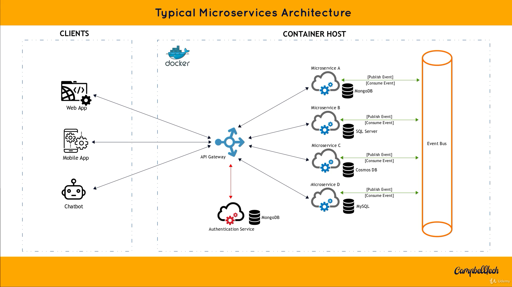

# designing-highly-scalable-systems

> **基于微服务：设计高可扩展系统**

## Menu

- The core principles of microservices
- Microservices benefits and anti-patterns
- The building blocks of a microservices architecture
- Client-to-microservice communication through an API gateway
- Event-driven communication using an event-bus
- How to secure microservices
- How to manage data in a microservices-based system
- How distributed transactions work with microservices
- Microservices success factors
- Containerization of microservices
- Tools and technologies to build and manage microservices
- How to convert a monolithic application into microservices
- CQRS
- Saga Pattern

> 基本上和三个月前刷的 `Stephen` 微服务课差不多，但那个是实战，这个是理论，稳固下吧。

